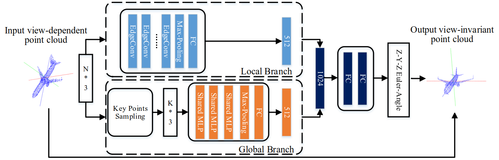

## Rotation Transformation Network: Learning View-Invariant Point Cloud for Classification and Segmentation

We propose a rotation transformation network for point cloud analysis, called RTN, which could reduce the RDF of input 3D objects to 0. The RTN could be seamlessly inserted into many existing DNNs for point cloud analysis.

[[PDF](https://ieeexplore.ieee.org/abstract/document/9428265)]

### Overview

This repository is the author's re-implementation of RTN. Extensive experimental results on 3D point cloud classification and segmentation tasks demonstrate that the proposed RTN could improve the performances of several state-of-the-art methods significantly.



Further information please contact [Shuang Deng](https://ds0529.github.io/) and [Qiulei Dong](http://vision.ia.ac.cn/Faculty/qldong/index.htm).

### Citation

Please cite this paper if you want to use it in your work:

	@inproceedings{2021rtn,
	title={Rotation Transformation Network: Learning View-Invariant Point Cloud For Classification And Segmentation}, 
	author={Deng, Shuang and Liu, Bo and Dong, Qiulei and Hu, Zhanyi},
	booktitle={Proceedings of the IEEE International Conference on Multimedia and Expo (ICME)}, 
	pages={1-6},
	year={2021},
	doi={10.1109/ICME51207.2021.9428265}
    }

### Data prepare

Download the HDF5 files of <a href="https://shapenet.cs.stanford.edu/media/modelnet40_ply_hdf5_2048.zip" target="_blank">ModelNet40</a> (416MB) and put the folder `modelnet40_ply_hdf5_2048` to `./align_modelnet` and `$your_data_folder`.

### Align ModelNet40

Align the ModelNet40 dataset:

```
cd align_modelnet
python data_prepare.py
```

, and put the generated folder `aligned_modelnet40_ply_hdf5_2048` to `$your_data_folder`.

### Train

Train the RTN. 

```
python train_learning_rotation_so3.py --gpu $your_gpu_id --data_path $your_data_folder --log_dir $your_RTN_model_path
```

Train the RTN+DGCNN. 

```
python train_rotation_pretrain_so3.py --gpu $your_gpu_id --data_path $your_data_folder --transformer_model_path $your_RTN_model_path --log_dir $your_model_path
```

### Test

Test the RTN. 

```
python evaluate_learning_rotation_so3.py --gpu $your_gpu_id --data_path $your_data_folder --model_path $your_RTN_model_path --dump_dir $your_RTN_test_path
```

Test the RTN+DGCNN. 

```
python evaluate_rotation_pretrain_so3.py --gpu $your_gpu_id --data_path $your_data_folder --transformer_model_path $your_RTN_model_path --model_path $your_model_path --dump_dir $your_test_path
```

The trained models are stored in the folder `result`.

### Acknowledgement

The structure of this codebase is borrowed from [DGCNN](https://github.com/WangYueFt/dgcnn).